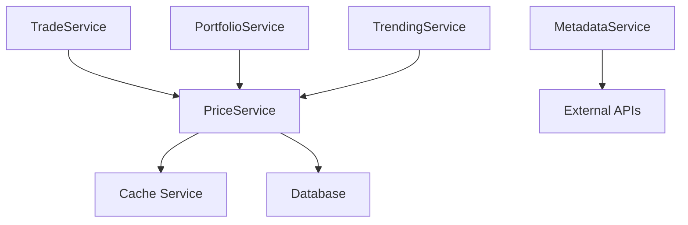

# 🔧 Backend API Guide

Comprehensive documentation for the SolSim Backend API, service architecture, and integration patterns.

## Table of Contents

- [🔧 Backend API Guide](#-backend-api-guide)
  - [Table of Contents](#table-of-contents)
  - [🏗️ Architecture Overview](#️-architecture-overview)
    - [Technology Stack](#technology-stack)
    - [Service Layer Architecture](#service-layer-architecture)
    - [Database Schema](#database-schema)
  - [🛠️ API Structure](#️-api-structure)
    - [Base Configuration](#base-configuration)
    - [Route Organization](#route-organization)
    - [Authentication System](#authentication-system)
  - [📡 API Endpoints Reference](#-api-endpoints-reference)
    - [Authentication Endpoints](#authentication-endpoints)
    - [Portfolio Management](#portfolio-management)
    - [Trading Operations](#trading-operations)
    - [Market Data](#market-data)
    - [User Management](#user-management)
    - [Leaderboard](#leaderboard)
    - [Monitoring](#monitoring)
  - [🔐 Security \& Middleware](#-security--middleware)
    - [Security Headers](#security-headers)
    - [Rate Limiting](#rate-limiting)
    - [Input Validation](#input-validation)
    - [Authentication Middleware](#authentication-middleware)
  - [🎯 Service Layer](#-service-layer)
    - [Service Factory Pattern](#service-factory-pattern)
    - [Core Services](#core-services)
    - [Service Dependencies](#service-dependencies)
  - [💾 Database Operations](#-database-operations)
    - [Prisma Configuration](#prisma-configuration)
    - [Transaction Patterns](#transaction-patterns)
    - [Query Optimization](#query-optimization)
  - [📊 Error Handling](#-error-handling)
    - [Error Response Format](#error-response-format)
    - [Error Types](#error-types)
    - [Logging Strategy](#logging-strategy)
  - [🚀 Performance \& Monitoring](#-performance--monitoring)
    - [Caching Strategy](#caching-strategy)
    - [Health Checks](#health-checks)
    - [Metrics Collection](#metrics-collection)
  - [🔄 Development Workflow](#-development-workflow)
    - [Environment Setup](#environment-setup)
    - [Database Migrations](#database-migrations)
    - [Testing Strategy](#testing-strategy)
    - [Adding New Endpoints](#adding-new-endpoints)

## 🏗️ Architecture Overview

### Technology Stack

| Component | Technology | Purpose |
|-----------|------------|---------|
| **Runtime** | Node.js 20+ | JavaScript runtime |
| **Framework** | Express.js | Web application framework |
| **Language** | TypeScript | Type safety and development experience |
| **Database** | PostgreSQL | Primary data storage |
| **ORM** | Prisma | Database operations and migrations |
| **Caching** | Redis | High-performance caching layer |
| **Authentication** | JWT | Stateless authentication |
| **File Upload** | Multer | Avatar and file handling |
| **Logging** | Winston | Structured logging |
| **Monitoring** | Prometheus | Metrics collection |

### Service Layer Architecture

```typescript
// Dependency injection pattern using ServiceFactory
export class ServiceFactory {
  private static instance: ServiceFactory
  
  // Core services
  public readonly priceService: PriceService
  public readonly trendingService: TrendingService
  public readonly portfolioService: PortfolioService
  public readonly tradeService: TradeService
  public readonly metadataService: MetadataService
}
```

### Database Schema

#### Core Entities

**Users Table**
```sql
model User {
  id                 String   @id @default(uuid())
  email              String   @unique
  username           String
  passwordHash       String
  
  // Profile
  displayName        String?
  bio                String?
  avatar             String?
  avatarUrl          String?
  
  // Trading
  virtualSolBalance  Decimal  @default("100")
  isProfilePublic    Boolean  @default(true)
  
  // Relations
  trades             Trade[]
  holdings           Holding[]
}
```

**Trades Table**
```sql
model Trade {
  id            String   @id @default(uuid())
  userId        String
  tokenAddress  String
  action        String   // 'buy' or 'sell'
  quantity      Decimal  // Number of tokens
  price         Decimal  // Price per token (USD)
  totalCost     Decimal  // Total cost (SOL)
  realizedPnL   Decimal? // Profit/Loss (SOL)
  timestamp     DateTime @default(now())
}
```

**Holdings Table**
```sql
model Holding {
  id              String  @id @default(uuid())
  userId          String
  tokenAddress    String
  quantity        Decimal @default("0")
  entryPrice      Decimal // Entry price (USD)
  avgBuyMarketCap Decimal? // Average market cap at purchase
}
```

## 🛠️ API Structure

### Base Configuration

```typescript
// Main server configuration
const app = express()
const httpServer = createServer(app)

// Middleware stack
app.use(express.json({ limit: '10mb' }))
app.use(express.urlencoded({ extended: true, limit: '10mb' }))
app.use(corsMiddleware)
app.use(monitoringService.getHttpMetricsMiddleware())
```

### Route Organization

```
/api/v1/
├── /auth          # Authentication
├── /user          # User management  
├── /portfolio     # Portfolio operations
├── /trades        # Trading operations
├── /market        # Market data
├── /leaderboard   # Rankings and stats
└── /monitoring    # Health and metrics
```

### Authentication System

#### Development Mode
```typescript
// Development bypass headers
headers.set('x-dev-user-id', 'dev-user-1')
headers.set('x-dev-email', 'dev-user-1@dev.local')
```

#### Production Mode
```typescript
// JWT token authentication
headers.set('Authorization', `Bearer ${token}`)
```

## 📡 API Endpoints Reference

### Authentication Endpoints

#### POST `/api/v1/auth/register`
Register a new user account.

**Request Body:**
```json
{
  "email": "user@example.com",
  "username": "trader123",
  "password": "securePassword",
  "displayName": "John Trader"
}
```

**Response:**
```json
{
  "success": true,
  "data": {
    "user": {
      "id": "uuid",
      "email": "user@example.com",
      "username": "trader123",
      "displayName": "John Trader"
    },
    "token": "jwt-token-here"
  }
}
```

#### POST `/api/v1/auth/login`
Authenticate existing user.

**Request Body:**
```json
{
  "email": "user@example.com",
  "password": "securePassword"
}
```

#### POST `/api/v1/auth/refresh`
Refresh authentication token.

**Headers:**
```
Authorization: Bearer <current-token>
```

### Portfolio Management

#### GET `/api/v1/portfolio`
Get user's complete portfolio including holdings and performance metrics.

**Response:**
```json
{
  "success": true,
  "data": {
    "totalValue": "1234.56",
    "solBalance": "45.67",
    "totalPnL": "234.56",
    "totalPnLPercentage": "23.45",
    "holdings": [
      {
        "tokenAddress": "0x123...",
        "tokenSymbol": "BONK",
        "tokenName": "Bonk Token",
        "quantity": "1000000",
        "entryPrice": "0.000001",
        "currentPrice": "0.000002",
        "value": "2000",
        "pnl": "1000",
        "pnlPercentage": "100"
      }
    ]
  }
}
```

#### GET `/api/v1/portfolio/performance`
Get detailed portfolio performance metrics.

**Query Parameters:**
- `timeframe`: `1h`, `24h`, `7d`, `30d` (default: `24h`)
- `includeChart`: `true`/`false` (default: `false`)

### Trading Operations

#### POST `/api/v1/trades/buy`
Execute a buy trade.

**Request Body:**
```json
{
  "tokenAddress": "EPjFWdd5AufqSSqeM2qN1xzybapC8G4wEGGkZwyTDt1v",
  "amountSol": 10.5,
  "tokenSymbol": "USDC",
  "tokenName": "USD Coin"
}
```

**Response:**
```json
{
  "success": true,
  "data": {
    "trade": {
      "id": "trade-uuid",
      "action": "buy",
      "tokenAddress": "EPjFWdd5AufqSSqeM2qN1xzybapC8G4wEGGkZwyTDt1v",
      "quantity": "10500000",
      "price": "1.0",
      "totalCost": "10.5",
      "timestamp": "2024-01-15T10:30:00Z"
    },
    "updatedBalance": "89.5",
    "newHolding": {
      "quantity": "10500000",
      "entryPrice": "1.0"
    }
  }
}
```

#### POST `/api/v1/trades/sell`
Execute a sell trade.

**Request Body:**
```json
{
  "tokenAddress": "EPjFWdd5AufqSSqeM2qN1xzybapC8G4wEGGkZwyTDt1v",
  "amountSol": 5.25
}
```

#### GET `/api/v1/trades/history`
Get user's trading history.

**Query Parameters:**
- `page`: Page number (default: 1)
- `limit`: Results per page (default: 50, max: 100)
- `tokenAddress`: Filter by specific token
- `action`: Filter by trade type (`buy`/`sell`)
- `startDate`: Start date (ISO string)
- `endDate`: End date (ISO string)

### Market Data

#### GET `/api/v1/market/trending`
Get trending tokens with price and volume data.

**Query Parameters:**
- `limit`: Number of results (default: 50, max: 100)
- `timeframe`: `5m`, `1h`, `24h` (default: `1h`)

**Response:**
```json
{
  "success": true,
  "data": [
    {
      "address": "token-address",
      "symbol": "BONK",
      "name": "Bonk Token",
      "imageUrl": "https://...",
      "price": "0.000001",
      "priceChange24h": "15.5",
      "volume24h": "1234567",
      "marketCap": "987654321",
      "isNew": false,
      "momentumScore": "85.5"
    }
  ]
}
```

#### GET `/api/v1/market/price/:tokenAddress`
Get current price for a specific token.

**Response:**
```json
{
  "success": true,
  "data": {
    "address": "token-address",
    "price": "1.0",
    "priceChange24h": "2.5",
    "volume24h": "50000",
    "marketCap": "1000000",
    "lastUpdated": "2024-01-15T10:30:00Z"
  }
}
```

### User Management

#### GET `/api/v1/user/profile`
Get current user's profile information.

#### PUT `/api/v1/user/profile`
Update user profile.

**Request Body:**
```json
{
  "displayName": "New Display Name",
  "bio": "Trading enthusiast",
  "twitter": "@username",
  "isProfilePublic": true
}
```

#### POST `/api/v1/user/avatar`
Upload user avatar image.

**Content-Type:** `multipart/form-data`
**Body:** Form data with `avatar` file field

### Leaderboard

#### GET `/api/v1/leaderboard/top`
Get top traders ranked by performance.

**Query Parameters:**
- `limit`: Number of results (default: 50, max: 100)
- `timeframe`: `24h`, `7d`, `30d`, `all` (default: `7d`)

### Monitoring

#### GET `/health`
System health check endpoint.

**Response:**
```json
{
  "status": "healthy",
  "timestamp": "2024-01-15T10:30:00Z",
  "uptime": 3600,
  "environment": "production",
  "version": "1.0.0",
  "services": {
    "database": "healthy",
    "cache": "healthy",
    "external_api": "healthy"
  },
  "metrics": {
    "memory_usage": "256MB",
    "cpu_usage": "15%"
  }
}
```

## 🔐 Security & Middleware

### Security Headers
```typescript
// Helmet security middleware
app.use(helmet({
  contentSecurityPolicy: {
    directives: {
      defaultSrc: ["'self'"],
      styleSrc: ["'self'", "'unsafe-inline'"],
      scriptSrc: ["'self'"],
      imgSrc: ["'self'", "data:", "https:"]
    }
  }
}))
```

### Rate Limiting
```typescript
// Trade operations rate limiting
const tradeLimiter = rateLimit({
  windowMs: 60 * 1000, // 1 minute
  max: 10, // 10 trades per minute
  message: "Too many trades, please try again later"
})

router.use('/trades', tradeLimiter)
```

### Input Validation
```typescript
// Joi validation schemas
const tradeSchema = Joi.object({
  tokenAddress: Joi.string().required(),
  amountSol: Joi.number().positive().max(1000000).required(),
  tokenSymbol: Joi.string().max(10),
  tokenName: Joi.string().max(100)
})
```

### Authentication Middleware
```typescript
export const authMiddleware = async (req: Request, res: Response, next: NextFunction) => {
  // Development mode bypass
  if (process.env.NODE_ENV === 'development') {
    const devUserId = req.headers['x-dev-user-id'] as string
    if (devUserId) {
      req.user = { id: devUserId }
      return next()
    }
  }

  // Production JWT validation
  const token = req.headers.authorization?.replace('Bearer ', '')
  if (!token) {
    return res.status(401).json({ success: false, error: 'No token provided' })
  }

  try {
    const decoded = jwt.verify(token, process.env.JWT_SECRET!) as { userId: string }
    req.user = { id: decoded.userId }
    next()
  } catch (error) {
    return res.status(401).json({ success: false, error: 'Invalid token' })
  }
}
```

## 🎯 Service Layer

### Service Factory Pattern
```typescript
// Singleton service factory for dependency injection
export class ServiceFactory {
  private static instance: ServiceFactory

  public static getInstance(): ServiceFactory {
    if (!ServiceFactory.instance) {
      ServiceFactory.instance = new ServiceFactory()
    }
    return ServiceFactory.instance
  }

  private constructor() {
    // Initialize services with dependencies
    this.priceService = new PriceService()
    this.portfolioService = new PortfolioService(this.priceService)
    this.tradeService = new TradeService(this.priceService)
  }
}
```

### Core Services

#### TradeService
```typescript
export class TradeService {
  async executeBuyTrade(request: InternalTradeRequest): Promise<TradeResult> {
    return prisma.$transaction(async (tx) => {
      // 1. Validate user balance
      // 2. Fetch current price
      // 3. Calculate trade amounts
      // 4. Create trade record
      // 5. Update holdings
      // 6. Update user balance
    }, {
      isolationLevel: 'Serializable'
    })
  }
}
```

#### PortfolioService
```typescript
export class PortfolioService {
  async getPortfolioSummary(userId: string): Promise<PortfolioSummary> {
    // Calculate total portfolio value
    // Fetch current holdings
    // Calculate P&L metrics
    // Return aggregated data
  }
}
```

#### PriceService
```typescript
export class PriceService {
  async getCurrentPrice(tokenAddress: string): Promise<TokenPrice> {
    // Check cache first
    // Fetch from external APIs
    // Update database
    // Cache result
  }
}
```

### Service Dependencies


## 💾 Database Operations

### Prisma Configuration
```typescript
// Enhanced Prisma client with connection pooling
const prisma = new PrismaClient({
  log: ['query', 'info', 'warn', 'error'],
  datasources: {
    db: {
      url: process.env.DATABASE_URL
    }
  }
})
```

### Transaction Patterns
```typescript
// Atomic trade execution
const result = await prisma.$transaction(async (tx) => {
  // All operations succeed or all fail
  const trade = await tx.trade.create({ data: tradeData })
  const holding = await tx.holding.upsert({ ... })
  const user = await tx.user.update({ ... })
  
  return { trade, holding, user }
}, {
  isolationLevel: 'Serializable', // Highest consistency
  timeout: 10000 // 10 second timeout
})
```

### Query Optimization
```typescript
// Optimized indexes for common queries
@@index([userId, timestamp(sort: Desc)], name: "user_trades_recent")
@@index([tokenAddress, timestamp(sort: Desc)], name: "token_trades_recent")
@@index([userId, tokenAddress, timestamp(sort: Desc)], name: "user_token_history")

// Efficient pagination queries
const trades = await prisma.trade.findMany({
  where: { userId },
  orderBy: { timestamp: 'desc' },
  skip: (page - 1) * limit,
  take: limit,
  include: {
    user: {
      select: { username: true, displayName: true }
    }
  }
})
```

## 📊 Error Handling

### Error Response Format
```json
{
  "success": false,
  "error": "Descriptive error message",
  "code": "ERROR_CODE",
  "details": {
    "field": "Additional context"
  },
  "timestamp": "2024-01-15T10:30:00Z"
}
```

### Error Types
```typescript
export class ApiError extends Error {
  constructor(
    message: string,
    public statusCode: number,
    public code?: string,
    public details?: any
  ) {
    super(message)
    this.name = 'ApiError'
  }
}

// Usage examples
throw new ApiError('Insufficient balance', 400, 'INSUFFICIENT_BALANCE')
throw new ApiError('Token not found', 404, 'TOKEN_NOT_FOUND')
throw new ApiError('Rate limit exceeded', 429, 'RATE_LIMIT')
```

### Logging Strategy
```typescript
// Structured logging with Winston
logger.info('Trade executed', {
  userId,
  tokenAddress,
  action: 'buy',
  amount: amountSol,
  duration: executionTime
})

logger.error('Trade failed', {
  userId,
  tokenAddress,
  error: error.message,
  stack: error.stack
})
```

## 🚀 Performance & Monitoring

### Caching Strategy
```typescript
// Redis caching for price data
const cacheKey = `price:${tokenAddress}`
const cachedPrice = await cacheService.get(cacheKey)

if (!cachedPrice) {
  const price = await fetchFromExternalAPI(tokenAddress)
  await cacheService.setex(cacheKey, 60, JSON.stringify(price)) // 1 minute TTL
  return price
}
```

### Health Checks
```typescript
async getHealthStatus(): Promise<HealthStatus> {
  const checks = {
    database: await this.checkDatabase(),
    cache: await this.checkCache(),
    external_api: await this.checkExternalAPIs()
  }

  const status = Object.values(checks).every(check => check === 'healthy') 
    ? 'healthy' 
    : 'degraded'

  return { status, checks, metrics: await this.getMetrics() }
}
```

### Metrics Collection
```typescript
// Prometheus metrics
const httpRequestsTotal = new promClient.Counter({
  name: 'http_requests_total',
  help: 'Total HTTP requests',
  labelNames: ['method', 'route', 'status']
})

const tradeExecutionTime = new promClient.Histogram({
  name: 'trade_execution_seconds',
  help: 'Trade execution time in seconds',
  buckets: [0.1, 0.5, 1, 2, 5]
})
```

## 🔄 Development Workflow

### Environment Setup
```bash
# Install dependencies
npm install

# Setup database
npm run db:generate
npm run db:push

# Start development server
npm run dev
```

### Database Migrations
```bash
# Create migration
npx prisma migrate dev --name add_new_feature

# Apply migration to production
npm run db:migrate:prod

# View database
npm run db:studio
```

### Testing Strategy
```typescript
// Jest test example
describe('TradeService', () => {
  it('should execute buy trade successfully', async () => {
    const request: TradeRequest = {
      tokenAddress: 'test-token',
      amountSol: 10
    }

    const result = await tradeService.executeBuyTrade('user-id', request)
    
    expect(result.success).toBe(true)
    expect(result.trade.action).toBe('buy')
  })
})
```

### Adding New Endpoints

1. **Create route file** in `src/routes/v1/`
2. **Define TypeScript interfaces** for request/response
3. **Implement validation middleware**
4. **Add service layer logic**
5. **Include error handling**
6. **Add to route index**
7. **Write tests**
8. **Update documentation**

```typescript
// Example: src/routes/v1/example.ts
import { Router } from 'express'
import { authMiddleware } from '../../middleware/auth.js'
import { validate } from '../../middleware/validation.js'

const router = Router()

router.use(authMiddleware)

router.get('/', validate(querySchema), async (req, res) => {
  try {
    const result = await exampleService.getData(req.user.id)
    res.json({ success: true, data: result })
  } catch (error) {
    logger.error('Example endpoint error:', error)
    res.status(500).json({ 
      success: false, 
      error: 'Internal server error' 
    })
  }
})

export default router
```

---

This backend API guide provides comprehensive documentation for developing, maintaining, and extending the SolSim backend services. Follow these patterns to ensure consistent, secure, and maintainable API development.
